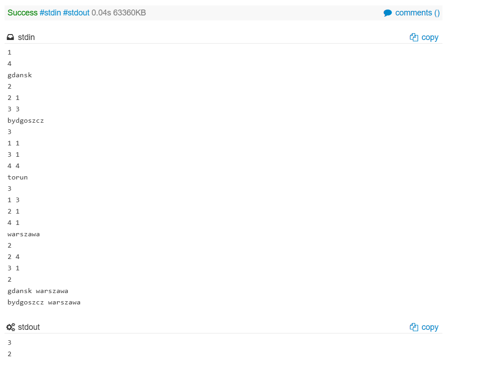

# SHPATH - The Shortest Path

## Link do problema

Problema no SPOJ: https://www.spoj.com/problems/SHPATH/

## Integrantes do grupo

- Integrante 1: ______________________________
- Integrante 2: ______________________________
- Integrante 3: ______________________________
- Integrante 4: ______________________________

## Linguagem utilizada

Python 3.

## Como executar a solução

Na raiz do repositório, execute:

```bash
python src/main.py < dados/entradas_do_problema.txt
```

O programa lê a entrada pela entrada padrão e imprime, para cada consulta, apenas o custo mínimo entre a cidade de origem e a cidade de destino.

## Modelagem do problema

O problema foi modelado como um grafo direcionado e ponderado:

- Cada cidade é representada como um vértice.
- Cada conexão direta entre cidades é representada como uma aresta direcionada.
- O custo de transporte entre duas cidades é o peso da aresta.
- Os nomes das cidades são mapeados para índices inteiros para facilitar o acesso às estruturas internas.
- O grafo é armazenado por lista de adjacência, em que cada posição contém os vizinhos diretos da cidade e os respectivos custos.

Essa representação é eficiente porque permite percorrer apenas as arestas que realmente saem de cada vértice, evitando o custo alto de uma matriz de adjacência para até 10.000 cidades.

## Algoritmo utilizado

Foi utilizado o algoritmo de Dijkstra com fila de prioridade mínima implementada com `heapq`.

Para melhorar o desempenho, as consultas são agrupadas pela cidade de origem. Assim, se várias consultas começam na mesma cidade, o Dijkstra é executado apenas uma vez para essa origem. O vetor de distâncias guarda o menor custo conhecido até cada cidade, e a fila de prioridade sempre seleciona a cidade ainda mais promissora, isto é, aquela com menor distância acumulada.

O algoritmo também usa parada antecipada: quando todos os destinos consultados para uma mesma origem já tiveram suas menores distâncias confirmadas, a busca termina.

## Relaxamento de arestas

O relaxamento acontece quando o algoritmo tenta melhorar o custo conhecido para chegar a uma cidade vizinha.

Se estamos em uma cidade `u`, com distância atual `dist[u]`, e existe uma aresta de `u` para `v` com custo `peso`, então testamos:

```text
dist[u] + peso < dist[v]
```

Se essa condição for verdadeira, encontramos um caminho melhor até `v`. Nesse caso, atualizamos `dist[v]` e inserimos a nova distância na fila de prioridade.

Como a mesma cidade pode entrar mais de uma vez na fila com custos diferentes, o código ignora entradas antigas. Quando uma distância retirada da fila é maior que a melhor distância registrada no vetor, essa entrada é descartada.

## Por que Dijkstra é adequado

O algoritmo de Dijkstra é adequado porque todas as conexões possuem custos positivos. Com pesos positivos, quando uma cidade é retirada da fila de prioridade com a menor distância conhecida, essa distância já representa o menor custo possível até aquela cidade.

Se existissem pesos negativos, Dijkstra não seria adequado, pois uma distância considerada definitiva poderia ser melhorada posteriormente por uma aresta negativa.

## Análise de complexidade

Considerando:

- `V` como o número de cidades;
- `E` como o número de conexões diretas.

Para cada origem distinta consultada:

- Tempo: `O((V + E) log V)`.
- Memória: `O(V + E)`.

O fator `log V` aparece por causa das operações de inserção e remoção na fila de prioridade.

## Evidência de Accepted

Inserir abaixo a imagem ou o link do Accepted no SPOJ:

```text
evidencias/accepted.png
```


